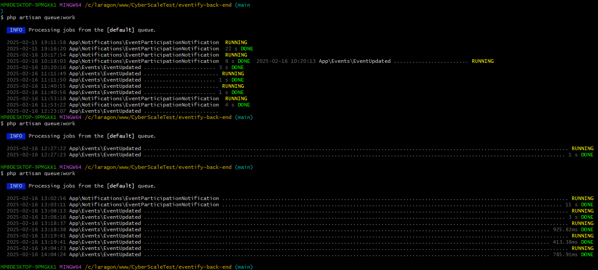
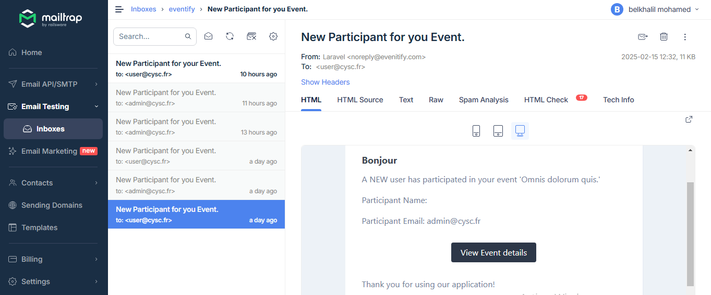
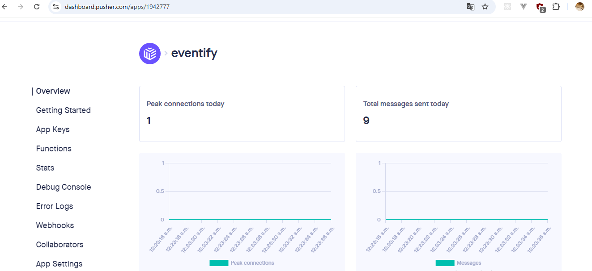

# Eventify Backend (Laravel) 🚀

This is the backend starter repository for **Eventify**, an event management platform. Built with Laravel, it provides APIs for user authentication, event management, and notifications.

---

## ✨ Features

- **User Authentication**  
  Secure registration and login using Laravel Sanctum

- **Event Management**

  - Create, update, and delete events.

- **Notifications**

  - Email notifications to creators when users join their events.
  - Real-time updates for participants when event details change.

- **API Endpoints**  
  RESTful APIs for seamless integration with the frontend.

---

## 🛠 Tech Stack

- **Framework**: Laravel (PHP)
- **Database**: MySQL
- **Authentication**: Laravel Sanctum
- **Email Notifications**: Laravel Mail (SMTP)
- **API Testing**: Postman
- **Pusher Provider**:pusher.com

---

## 🚀 Installation

1. **Clone the Repository**

   ```bash
   git clone https://github.com/CyberScale-test/eventify-back-end.git
   cd eventify-back-end
   ```

2. **Install the composer**

```bash
composer install
```

3. **Install the composer**

```bash
cp .env.example .env
```

4. **Create Database**

```bash
mysql -u root -p
CREATE DATABASE eventify;
exit;
```

5. **Configure Database in your .env**

```bash
DB_CONNECTION=mysql
DB_HOST=127.0.0.1
DB_PORT=3306
DB_DATABASE=CyberScale
DB_USERNAME=root
DB_PASSWORD=your_password
```

6. **Generate App Key**

```bash
php artisan key:generate
```

7. **Run Migrations & Seeders**

```bash
php artisan migrate --seed
```

8. **Install Pusher for Real-time Notification**

```bash
composer require pusher/pusher-php-server
```

9. **Configure Pusher in your .env**

```bash
PUSHER_APP_ID=your_app_id
PUSHER_APP_KEY=your_app_key
PUSHER_APP_SECRET=your_app_secret
PUSHER_PORT=443
PUSHER_SCHEME=https
PUSHER_APP_CLUSTER=your_app_cluster
```

10. **Configure Mailtrap**

```bash
MAIL_MAILER=smtp
MAIL_HOST=localhost
MAIL_PORT=2525
MAIL_USERNAME=
MAIL_PASSWORD=
MAIL_FROM_ADDRESS="noreply@evenitify.com"
MAIL_FROM_NAME="${API_NAME}"
```

11. **Start the server**

```bash
php artisan serve
```

## Screenshots From The Backend




